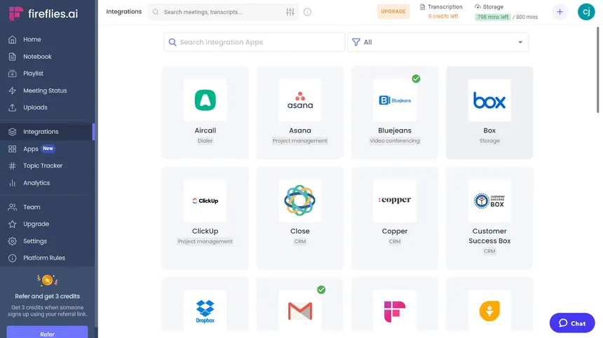
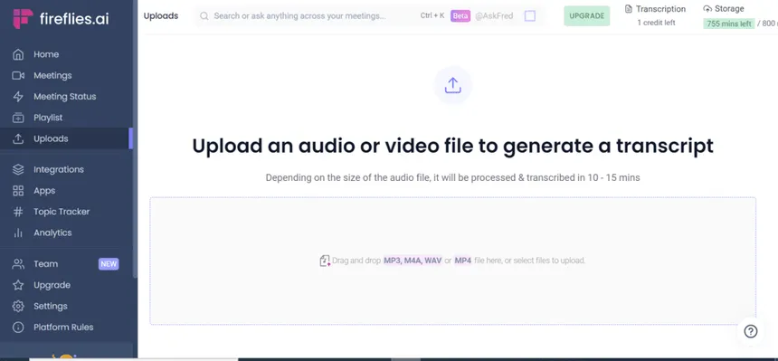
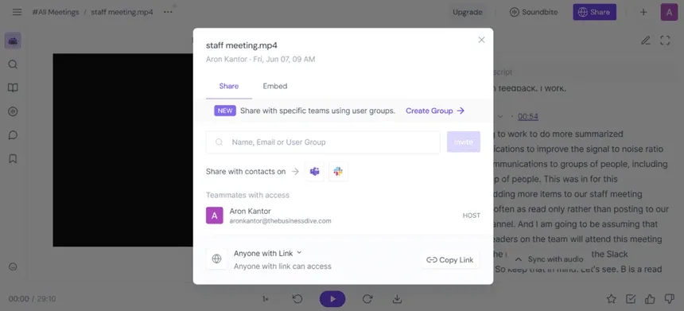

<div align="center">

# 🔥 Fireflies.ai Clone

**A full-stack meeting notes & transcription workspace**

Built with **Next.js 15** · **FastAPI** · **SQLAlchemy** · **SQLite** · **TypeScript**

[](#testing)
[](#testing)
[](#testing)
[](#testing)
[](#testing)

</div>

---

<p align="center">
  
  &nbsp;&nbsp;
  
  &nbsp;&nbsp;
  
</p>

<p align="center"><em>Reference screenshots the UI was derived from</em></p>

---

## 📋 Table of Contents

- [Overview](#overview)
- [Features](#features)
- [Tech Stack](#tech-stack)
- [Getting Started](#getting-started)
- [Project Structure](#project-structure)
- [Architecture](#architecture)
- [Database Schema](#database-schema)
- [API Reference](#api-reference)
- [Testing](#testing)
- [Environment Variables](#environment-variables)
- [Deployment](#deployment)
- [Security](#security)
- [Known Limitations](#known-limitations)
- [License](#license)

---

## Overview

A faithful clone of the **Fireflies.ai Notepad / Meeting Library** experience. Record (or import) a meeting transcript and the app provides:

- A **searchable meeting library** with filters, sorting, and tags
- A **two-panel meeting notepad** with AI-generated notes alongside a synced transcript
- A **media player** whose seek position drives the highlighted transcript line (and vice-versa)
- Full **CRUD** over meetings, transcripts, action items, comments, and tags — all persisted server-side

> **Note:** Real speech-to-text, recording bots, and calendar integrations are out of scope. AI notes are generated by a **deterministic local summarizer** — no external LLM calls or API keys required.

---

## Features

### 📚 Meeting Library (`/meetings`)

| Feature | Description |
|---------|-------------|
| **Search** | Full-text search across titles, participants, and transcript content (debounced, URL-synced) |
| **Filters** | Filter by participant, date range (`7d`, `30d`, `90d`, `all`), and tags |
| **Sorting** | Newest or oldest first |
| **URL State** | All filter state lives in the URL — shareable, back/forward works |
| **States** | Loading skeletons, empty state, and error state with retry |

### 📝 Meeting Notepad (`/meetings/[meetingId]`)

| Feature | Description |
|---------|-------------|
| **AI Notes Panel** | Overview, key points, chapters & outline, topics, action items |
| **Transcript Panel** | Speaker labels, timestamps, search with highlighted matches |
| **Bidirectional Sync** | Click a transcript line → seeks player. Move player → highlights transcript line |
| **Action Items** | Add, inline edit, complete/uncomplete, delete — all persisted |
| **Transcript Editing** | Edit any segment's text, or replace the entire transcript |
| **Comments** | Anchor comments to transcript lines; timestamp chips seek the player |
| **Tags** | Add/remove tags with suggestions; click a tag to filter the library |
| **Keyboard Shortcuts** | `Space` play/pause, `←`/`→` seek ±5s (respects focused inputs) |
| **Export** | Download notes + transcript as Markdown, plain text, or PDF |

### ⬆️ Uploads (`/uploads`)

- Tabbed **Upload file / Paste transcript** interface with drag-and-drop
- Accepts **TXT**, **VTT**, and **JSON** transcript formats
- Clear error toasts for unsupported file types

### 🎨 Shell & Navigation

- **Dark Mode**: A polished, application-wide dark theme. Toggle it from the Settings page (preference persists locally).
- Dark sidebar with grouped navigation, active-row highlighting, and badges
- Compact topbar with global search (`Ctrl/⌘ K`), credits chip, and profile menu
- Placeholder pages for Home, Meeting Status, Playlist, Integrations, and more
- Toast notifications, centered modals, consistent loading/empty/error states

---

## Tech Stack

| Layer | Technology |
|-------|------------|
| **Frontend** | Next.js 15 (App Router), React 19, TypeScript 5.7 (strict), Tailwind CSS 4 |
| **Backend** | Python 3.11+, FastAPI 0.142, Uvicorn, Pydantic v2 |
| **Database** | SQLite + SQLAlchemy 2.x (declarative, typed `Mapped[...]` models) |
| **Testing** | Vitest 5 (unit), Playwright 1.63 (E2E), pytest (backend) |
| **API** | RESTful JSON under `/api` with consistent error responses |

---

## Getting Started

### Prerequisites

- **Node.js** 22.12+ (required by Vitest 5)
- **Python** 3.11+

### 1. Clone the repository

```bash
git clone https://github.com/Aryzenshi/fireflies-clone.git
cd fireflies-clone
```

### 2. Backend Setup

```bash
cd backend
python -m venv venv
# Windows:
venv\Scripts\activate
# macOS/Linux:
source venv/bin/activate

pip install -r requirements.txt
python -m uvicorn app.main:app --reload --port 8000
```

The API will be available at http://127.0.0.1:8000/api with interactive docs at http://127.0.0.1:8000/docs.

> The database (`backend/data/fireflies.db`) is auto-created and seeded on first startup when `AUTO_SEED=true` (default).

### 3. Frontend Setup

```bash
cd frontend
npm install
npm run dev          # Development: http://localhost:3000
# or
npm run build && npm start   # Production build
```

The frontend proxies all `/api/*` requests to the backend via `next.config.ts` — no hardcoded API host.

### 4. Seeding the Database

```bash
cd backend
python -m app.seed            # Add demo meetings (safe to re-run)
python -m app.seed --force    # Replace existing seed meetings
python -m app.seed --reset    # Delete everything, then seed fresh
```

Six original demo meetings are included with 107 transcript segments, 26 action items, summaries, topics, and chapters.

---

## Project Structure

```
fireflies-clone/
├── backend/
│   ├── app/
│   │   ├── api/              # Route handlers (health, meetings, action_items, comments)
│   │   ├── core/             # Config (env-driven), error definitions
│   │   ├── db/               # Database session, initialization, migrations
│   │   ├── models/           # SQLAlchemy models (User, Meeting, Participant, etc.)
│   │   ├── schemas/          # Pydantic v2 request/response models
│   │   ├── repositories/     # Database queries and ORM operations
│   │   ├── services/         # Business logic, summarizer, transcript parser, exporter
│   │   ├── seed_data/        # Demo dataset (meetings.json)
│   │   ├── main.py           # App factory, CORS, error handlers, startup
│   │   └── seed.py           # CLI seeder
│   ├── tests/                # pytest test suite
│   └── requirements.txt
│
├── frontend/
│   ├── app/                  # Next.js routes + global styles
│   ├── components/
│   │   ├── shell/            # AppShell, Sidebar, Topbar
│   │   ├── meetings/         # Library, table, filters, create modal
│   │   ├── notepad/          # Workspace, player, transcript, summary, comments
│   │   ├── ui/               # Reusable components (Modal, Button, Input, etc.)
│   │   └── icons.tsx         # All inline SVG icons (no external dependencies)
│   ├── hooks/                # Data fetching hooks (useMeetings, useAsyncData, etc.)
│   ├── lib/                  # API client, types, formatters, constants
│   ├── tests/                # Unit tests + Playwright E2E specs
│   └── package.json
│
├── docs/                     # Assignment docs, design specs, reference screenshots
├── SECURITY.md               # Security audit report
└── README.md
```

---

## Architecture

```
Browser (React 19 / Next.js App Router)
   │  relative /api/* calls  (Next rewrites → FastAPI)
   ▼
FastAPI Routes   (app/api/routes/*)       ← HTTP validation, status codes
   ▼
Services         (app/services/*)         ← Business logic, summarization, parsing
   ▼
Repositories     (app/repositories/*)     ← Query construction, eager loading
   ▼
SQLAlchemy 2.x Models (app/models/*)  →  SQLite
```

### Design Principles

- **No SQL in routes** — handlers validate input, call services, return Pydantic schemas
- **No ORM objects escape the API** — every response goes through `app/schemas/*`
- **No business logic in components** — React components render props and call hooks
- **Errors are always JSON** — `{"detail": "..."}` with appropriate status codes
- **Single source of truth for playback** — `currentTimeSeconds` is owned once in `MeetingWorkspace`; transcript sync and seeking derive from the same state

### Playback Synchronization

The `MeetingWorkspace` component holds exactly one `currentTimeSeconds` state with a 250ms interval tick. Everything else is derived:

- **Player → Transcript**: Active segment computed from `currentTimeSeconds` against segment boundaries
- **Transcript → Player**: Row click calls `seek(segment.start_seconds)`, writing the same state
- **Seek bar**: Reads and writes the same value, fully keyboard-operable

Because there is a single writer, the two directions cannot disagree.

---

## Database Schema

SQLite, managed by SQLAlchemy. Cascade deletes ensure referential integrity.

```
users ──1:N── meetings ──1:N── meeting_participants ──N:1── participants
                  ├──────1:N── transcript_segments
                  ├──────1:1── meeting_summaries ──1:N── summary_sections
                  ├──────1:N── action_items
                  └──────1:N── meeting_comments
```

| Table | Purpose |
|-------|---------|
| `users` | Single demo user (auth is out of scope) |
| `meetings` | Core entity with title, date, duration, tags, source type |
| `participants` | Deduplicated across meetings, linked via join table |
| `transcript_segments` | Ordered segments with speaker, timestamps, text |
| `meeting_summaries` | AI-generated overview and topics (one per meeting) |
| `summary_sections` | Key points and chapters linked to summaries |
| `action_items` | Tasks with assignee, due date, completion status |
| `meeting_comments` | Optionally anchored to transcript segments |

Full DDL documentation available in [`docs/DATABASE.md`](docs/DATABASE.md).

---

## API Reference

Base URL: `/api` · All errors: `{"detail": "..."}`

| Method | Endpoint | Description |
|--------|----------|-------------|
| `GET` | `/health` | Liveness + DB check |
| `GET` | `/meetings` | List meetings (query, filters, sort, pagination) |
| `POST` | `/meetings` | Create a meeting |
| `POST` | `/meetings/import` | Upload a transcript file (TXT/VTT/JSON) |
| `GET` | `/meetings/:id` | Full meeting with all related data |
| `PATCH` | `/meetings/:id` | Update title and/or participants |
| `DELETE` | `/meetings/:id` | Cascade delete |
| `GET` | `/meetings/:id/transcript` | Get transcript segments |
| `POST` | `/meetings/:id/transcript` | Replace transcript + regenerate notes |
| `PATCH` | `/meetings/:id/transcript/:segId` | Edit a segment |
| `POST` | `/meetings/:id/summary/regenerate` | Regenerate AI notes |
| `GET` | `/meetings/:id/action-items` | List action items |
| `POST` | `/meetings/:id/action-items` | Create action item |
| `PATCH` | `/action-items/:id` | Update action item |
| `DELETE` | `/action-items/:id` | Delete action item |
| `GET` | `/meetings/:id/export` | Download as Markdown, TXT, or PDF |
| `GET` | `/meetings/:id/comments` | List comments |
| `POST` | `/meetings/:id/comments` | Add comment (optionally anchored) |
| `PATCH` | `/comments/:id` | Edit comment |
| `DELETE` | `/comments/:id` | Delete comment |
| `GET` | `/tags` | Tag directory with counts |
| `GET` | `/participants` | Participant directory with counts |
| `GET` | `/users/me` | Current demo user |
| `GET` | `/stats` | Dashboard counters |

Full API documentation available at [`docs/API.md`](docs/API.md) and via the interactive Swagger UI at `/docs`.

---

## Testing

All test suites pass against the current codebase.

### Backend — 59 tests

```bash
cd backend && python -m pytest -q
```

Covers: meeting CRUD, filters/sort, validation, transcript replacement, segment editing, action-item lifecycle, TXT/VTT/JSON parser, deterministic summarizer, idempotent seeding, Markdown/TXT exporters, tags (CRUD, dedup, filtering, directory), comments (anchoring, CRUD, cascade), security regression tests (SQL injection, XSS, mass assignment, path traversal, upload limits), and query-count guards.

### Frontend Unit — 19 tests

```bash
cd frontend && npm run test:unit
```

### End-to-End — 24 Playwright tests

```bash
# Terminal 1: Start backend
cd backend && python -m uvicorn app.main:app --port 8000

# Terminal 2: Build and start frontend
cd frontend && npm run build && npm start

# Terminal 3: Run tests
cd frontend && npx playwright test
```

Covers: library views, search, filters, sorting, empty state, notepad panels, bidirectional transcript-player sync, action items, title/participant edits, transcript editing, share dialog, CRUD + import, keyboard shortcuts, exports, tags, comments, console/hydration error guards, and shell navigation.

> **First run:** Install Playwright browsers with `npx playwright install chromium`

---

## Environment Variables

| Variable | Service | Default | Description |
|----------|---------|---------|-------------|
| `DATABASE_URL` | Backend | `sqlite:///backend/data/fireflies.db` | SQLAlchemy connection URL |
| `AUTO_SEED` | Backend | `true` | Auto-seed empty database on startup |
| `CORS_ORIGINS` | Backend | `http://localhost:3000,http://127.0.0.1:3000` | Allowed browser origins |
| `MAX_UPLOAD_BYTES` | Backend | `10485760` (10 MB) | Upload size limit |
| `DEFAULT_USER_NAME` | Backend | `Aaron Kantor` | Demo user display name |
| `DEFAULT_USER_EMAIL` | Backend | `aaron.kantor@thebusinessdrive.com` | Demo user email |
| `TRANSCRIPTION_MINUTES_QUOTA` | Backend | `800` | Credits widget value |
| `API_PROXY_TARGET` | Frontend | `http://127.0.0.1:8000` | Backend URL for API proxy |
| `E2E_BASE_URL` | Tests | `http://127.0.0.1:3000` | Playwright target URL |

> No secrets or API keys are required.

---

## Deployment

The backend and frontend are independent services:

### Backend

Deploy on any Python host (Render, Railway, Fly.io, a VM):

```bash
uvicorn app.main:app --host 0.0.0.0 --port $PORT
```

- Set `DATABASE_URL` (SQLite on a persistent volume, or swap to Postgres — the ORM is dialect-agnostic)
- Set `CORS_ORIGINS` to the frontend origin
- Run `python -m app.seed` once for demo data; set `AUTO_SEED=false` in production

### Frontend

Deploy on Vercel or any Node host:

```bash
npm run build && npm start
```

- Set `API_PROXY_TARGET` to the deployed backend URL
- The proxy keeps the browser on a single origin — no CORS issues

---

## Security

A comprehensive security audit has been completed. See [`SECURITY.md`](SECURITY.md) for the full report.

**Key hardening measures:**
- Upgraded `python-multipart` to patch known DoS vulnerabilities
- Added HTTP security headers (`X-Content-Type-Options`, `X-Frame-Options`, `Referrer-Policy`)
- Security regression test suite covering SQL injection, XSS, mass assignment, path traversal, and upload limits
- Parameterized queries via SQLAlchemy ORM (no raw SQL)
- Pydantic `extra="forbid"` prevents mass assignment
- File uploads processed in-memory only (no disk writes)
- 10 MB upload size limit enforced server-side

---

## Assumptions & Known Limitations

**Assumptions Made:**
- **Single User Context**: Real user authentication is mocked. The backend assumes a default logged-in user (`owner_id`) for all created entities.
- **Mocked Platform Features**: Features requiring significant third-party infrastructure—such as the real-time bot that joins live calls, calendar integrations, and CRM sync—are present in the UI as "Coming Soon" placeholders.
- **Transcription**: Actual speech-to-text processing of audio files is out of scope. Users provide transcript text via pasting or file upload (TXT, VTT, JSON).
- **Collaboration**: Team management, seats, and actual sharing permissions are out of scope. The share dialog operates in a display-only mock mode.
- **AI Notes Generation**: Notes are generated via a deterministic, local, heuristic-based parser rather than relying on external LLM calls (to eliminate API key requirements and latency).

**Known Limitations:**
- **Share dialog is display-only** — no invites are actually sent via email.
- **No database migration framework** — schema updates require manual handling or dropping the SQLite file.
- **Uploads limited to TXT/VTT/JSON** — up to a maximum of 10 MB.

---

## License

Original implementation. No Fireflies.ai source code, assets, or data were copied. The UI re-implements the layout from supplied design notes and screenshots. All seed data is original fiction, and all icons are inline SVGs drawn for this project.
